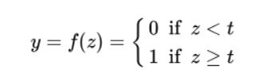

# Neural Network
A neural network is one of machine learning models. The basic idea behind neural network is to simulate how human's brain cells work to learn things, recognize patterns, and make decision. Neural network consist of artificial neurons called units arranged in a series of layers with each connects to the layers on either side. Units could be devide into three :
1. `input units` : the input layer consists of one or more feature variables, denoted as x1, x2, ..., xn. It is designed to receive various data from outside.
2. `output units` : on the opposite side, the output units will signal how it responds to the information it's learned.
3. `hidden units` : a hidden units are one or more layers of units between input units and output units.

Below is the structure of a basic neural network looks like, it looks like a simple neuron in human brain.

<br>

## Key Components of Neural Network
1. `Input`: Inputs are the features that are fed into the model for learning purposes.
2. `Weights`: Is a parameter that able to influence the input by increasing or decreasing the strength of the signal at a connection.
3. `Bias`: Have a role to control the activation node by delay the activation or accelerate it.
4. `Transfer Function`: A function that will combine the weighted inputs to output.
5. `Activation Function` : An activation decides whether a neuron should be activated or not. It will activate the neuron if it finds the input important in the process of predicting using mathematical operations.

## The Importance of Using Activation Function
Without activation function, a neuron will act as a linear model and will look for a linear pattern in the data. This way the neural network would not be able to detect the data with complex patterns.

## Most Commonly Used Activation Functions
### 1. Step Function
Int this function, if the value of the weighted sum input say `z` is greater than the threshold, then it will activated the neuron.

Equation : 



Graph :


### 2. Sigmoid Function
This function is one of the widely used functions in neural network. The curve of sigmoid function is S-shaped with value range 0 and 1.

Equation :


Graph :


### 3. ReLU Function
If w have input z, this function's output will be z if z is positive, otherwise, it outputs zero.

Equation :


Graph : 


## Implementation of Neural Network
There are so many implementation of neural network, in this section we will develop a handwritten number recognition. We will developing and training our veural network that predicts a specific image of a handwritten digit.

As for library we use keras from tensorflow, we will use this several modules
```python
from tensorflow.keras.datasets import mnist
from tensorflow.keras.utils import to_categorical
from tensorflow.keras.models import Sequential
from tensorflow.keras.layers import Conv2D
from tensorflow.keras.layers import MaxPooling2D
from tensorflow.keras.layers import Dense
from tensorflow.keras.layers import Flatten
from tensorflow.keras.optimizers import SGD
```

In `load_dataset` function, we will load the data from MNIST (Modified National Institute of Standards and Technology), is a large database of handwritten digits. We will also plot the first few images from the dataset.

```python
# load train and test dataset
def load_dataset():
	# load dataset
  (trainX, trainY), (testX, testY) = mnist.load_data()
  for i in range(9):
    # define subplot
    plt.subplot(330 + 1 + i)
    # plot raw pixel data
    plt.imshow(trainX[i], cmap=plt.get_cmap('gray'))
  # show the figure
  print("Plot first few images from the dataset")
  plt.show()
	# reshape dataset to have a single channel
  trainX = trainX.reshape((trainX.shape[0], 28, 28, 1))
  testX = testX.reshape((testX.shape[0], 28, 28, 1))
	# one hot encode target values
  trainY = to_categorical(trainY)
  testY = to_categorical(testY)
  return trainX, trainY, testX, testY
```

Next in `prep_pixels` function we will normalize the color by deviding it with 255, the maximal value of a color. This way we will get a value ranged from 0 to 1.

```python
def prep_pixels(train, test):
	# convert from integers to floats
	train_norm = train.astype('float32')
	test_norm = test.astype('float32')
	# normalize to range 0-1
	train_norm = train_norm / 255.0
	test_norm = test_norm / 255.0
	# return normalized images
	return train_norm, test_norm
```

`define_model` function has two main aspect feature extraction front end and the classifier backend that will do the prediction. In the convolutional front-end, let's set the convolutional layer with a small filter size(3,3) and modest number filters (32) followed by max pooling layer.

Since we need to classify images into 10 classes so we set the output nodes into 10, while between the feature extractor and the output layer we add 100 nodes.

```python
# define cnn model
def define_model():
	model = Sequential()
	model.add(Conv2D(32, (3, 3), activation='relu', kernel_initializer='he_uniform', input_shape=(28, 28, 1)))
	model.add(MaxPooling2D((2, 2)))
	model.add(Conv2D(64, (3, 3), activation='relu', kernel_initializer='he_uniform'))
	model.add(Conv2D(64, (3, 3), activation='relu', kernel_initializer='he_uniform'))
	model.add(MaxPooling2D((2, 2)))
	model.add(Flatten())
	model.add(Dense(100, activation='relu', kernel_initializer='he_uniform'))
	model.add(Dense(10, activation='softmax'))
	# compile model
	opt = SGD(learning_rate=0.01, momentum=0.9)
	model.compile(optimizer=opt, loss='categorical_crossentropy', metrics=['accuracy'])
	return model
```

In `evaluate_model` the model will be evaluated using five-fold cross-validation with `k=5`. This function taking the training dataset as arguments and return a list of training histories that can be summarized later.

```python
def evaluate_model(dataX, dataY, X_val, y_val, n_folds=5):
  scores, histories = list(), list()
	# prepare cross validation
  kfold = KFold(n_folds, shuffle=True, random_state=1)
	# enumerate splits
  for train_ix, test_ix in kfold.split(dataX):
		# define model
    model = define_model()
		# select rows for train and test
    trainX, trainY, testX, testY = dataX[train_ix], dataY[train_ix], dataX[test_ix], dataY[test_ix]
    print("Fit model on training data")
    history = model.fit(trainX, trainY, epochs=10, batch_size=32, validation_data=(X_val, y_val))
    histories.append(history)
  return scores, histories, model
```

After the model has been evaluated, we can show the result. We will use matplotlib to show the result

```python
def summarize_diagnostics(histories):
	for i in range(len(histories)):
		# plot loss
		plt.subplot(2, 1, 1)
		plt.title('Cross Entropy Loss')
		plt.plot(histories[i].history['loss'], color='blue', label='train')
		plt.plot(histories[i].history['val_loss'], color='orange', label='test')
		# plot accuracy
		plt.subplot(2, 1, 2)
		plt.title('Classification Accuracy')
		plt.plot(histories[i].history['accuracy'], color='blue', label='train')
		plt.plot(histories[i].history['val_accuracy'], color='orange', label='test')
	plt.show()
```

We then will call all of the function in `run_test_harness` in this function we will also save the model into our directory

```python
# run the test harness for evaluating a model
def run_test_harness():
  histories = list()
	# load dataset
  trainX, trainY, testX, testY = load_dataset()
	# prepare pixel data
  trainX, testX = prep_pixels(trainX, testX)
	# evaluate model
  scores, histories, model = evaluate_model(trainX, trainY, testX, testY)
  # learning curves
  summarize_diagnostics(histories)
	# save model
  model.save('final_model.h5')
  print("model saved!")
```

Last to run the program we only need to call the above function :

```python
# entry point, run the test harness
run_test_harness()
```

By running the above program, we will got the output as shown below :


Result :


After building the model, we then can use this model to predict some images. I use [sample_image2](https://lcmlinebot.tk/digit/sample_image2.png), [sample_image3](https://lcmlinebot.tk/digit/sample_image3.png), [sample_image5](https://lcmlinebot.tk/digit/sample_image5.png), [sample_image8](https://lcmlinebot.tk/digit/sample_image8.png), and [sample_imagge](https://machinelearningmastery.com/wp-content/uploads/2019/02/sample_image.png) as images to be predicted.

```python
# make a prediction for a new image.
import cv2
from google.colab.patches import cv2_imshow
from numpy import argmax
from keras.preprocessing.image import load_img
from keras.preprocessing.image import img_to_array
from keras.models import load_model
 
# load and prepare the image
def load_image(filename):
	# load the image
  img = load_img(filename, grayscale=True, target_size=(28, 28))
	# convert to array
  img = img_to_array(img)
	# reshape into a single sample with 1 channel
  img = img.reshape(1, 28, 28, 1)
	# prepare pixel data
  img = img.astype('float32')
  img = img / 255.0
  return img
 
# load an image and predict the class
def run_example(images):
  for image in images:
    # load the image
    img = load_image(image)
    # show image
    img2 = cv2.imread(image)
    img2 = cv2.resize(img2, (80, 80))
    cv2_imshow(img2)
    # load model
    model = load_model('final_model.h5')
    # predict the class
    predict_value = model.predict(img)
    digit = argmax(predict_value)
    print(f'Predicted : {digit}')
    print('')
 
# entry point, run the example
images = ['sample_image2.png','sample_image3.png','sample_image5.png','sample_image8.png','sample_image.png']
run_example(images)
```

The output result :


For the full code, please open this google colab link [(share)NeuralNetwork(Handwritting_recognition).ipynb](https://colab.research.google.com/drive/1qy2WWvO5dZqrO3uSmPRAZR4RTKSTuZfH?usp=sharing).

# References
1. https://machinelearningmastery.com/how-to-develop-a-convolutional-neural-network-from-scratch-for-mnist-handwritten-digit-classification/
2. https://www.analyticsvidhya.com/blog/2021/11/artificial-neural-network-and-its-implementation-from-scratch/
3. https://www.hotelmize.com/blog/how-does-a-neural-network-work-implementation-and-5-examples/
4. https://www.tensorflow.org/guide/keras/train_and_evaluate